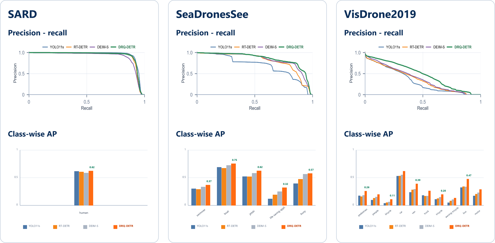
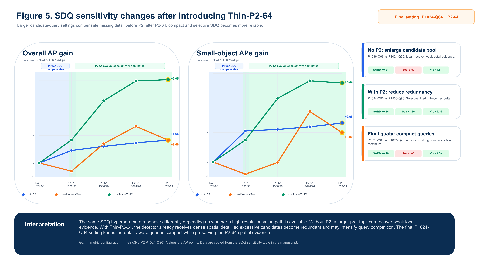

# DRQ-DETR

**Detail-Routed Query Transformer for Drone-View Small Object Detection**

DRQ-DETR is the code release for a drone-view small-object detector designed
around three detail-aware components: a detail-semantic proxy router, sparse
detail query selection, and cross-granularity receptive-field fusion. The final
public model uses a 64-channel Thin-P2 value path, selects 64 detail-aware
queries from 1024 proxy candidates, and keeps Detail Gate Alignment (DGA)
disabled by default.

This repository is prepared for paper review and reproduction. It contains the
model implementation, final experiment configs, ablation and sensitivity
configs, checkpoint validation helpers, and a reproducible FPS benchmark.
Datasets and trained weights are not stored in Git.

<p align="center">
  
</p>

<p align="center">
  <b>Figure 1.</b> Paper overview of DRQ-DETR. DSPR builds a stride-4
  detail-semantic proxy, SDQ reserves detail-aware decoder queries, CGRF injects
  gated proxy information into P3/P4, and Thin-P2-64 supplies a compact
  high-resolution value feature to the decoder.
</p>

## Highlights

- **DSPR: Detail-Semantic Proxy Router.** Builds a compact stride-4 proxy from
  shallow P2 detail and P3 semantic context.
- **SDQ: Sparse Detail Query Selection.** Ranks dense proxy tokens and reserves
  64 detail-aware object queries from 1024 candidates.
- **CGRF: Cross-Granularity Receptive-Field Fusion.** Uses gated proxy routing
  to refine P3 and P4 without converting the detector into a heavy full-P2
  design.
- **Thin-P2-64 value path.** Keeps a 64-channel stride-4 value branch for small
  objects while maintaining a moderate computational cost.
- **Cross-dataset validation.** The same fair 132-epoch protocol is used on
  SARD, SeaDronesSee-ODv2, and VisDrone2019.

## Final Public Configuration

The paper name **DRQ-DETR** refers to the fixed public configuration below.

| Item | Setting |
|---|---:|
| Input size | 640 x 640 |
| Backbone | HGNetV2-B0 style |
| Decoder | D-FINE decoder, 3 layers |
| Total decoder queries | 300 |
| DSPR proxy stride | 4 |
| SDQ proxy candidates | 1024 |
| SDQ detail queries | 64 |
| Semantic queries | 236 |
| Decoder value strides | 4, 8, 16, 32 |
| Thin-P2 width | 64 channels |
| DGA regularizer | Disabled |

Canonical final architecture:

```text
configs/models/drq_detr_p2_64.yml
```

Canonical final experiment entries:

```text
configs/experiments/sard/drq_detr.yml
configs/experiments/seadronessee_odv2/drq_detr.yml
configs/experiments/visdrone2019/drq_detr.yml
```

## Main Paper Results

The table below reports the final P2-64 model without DGA. Accuracy is
COCO-style AP in percentage points. FPS was measured with the repository
benchmark on a single NVIDIA GeForce RTX 4090, FP32, batch size 1, 640 x 640
input, 30 warmup iterations, and 100 measured iterations. Post-processing is
included where applicable.

| Dataset | AP | AP50 | AP75 | APs | APm | APl | Params (M) | GFLOPs | FPS | Latency (ms) |
|---|---:|---:|---:|---:|---:|---:|---:|---:|---:|---:|
| SARD | 62.22 | 92.41 | 70.89 | 33.29 | 64.91 | 75.13 | 12.00 | 54.07 | 61.59 | 16.24 |
| SeaDronesSee-ODv2 | 52.65 | 84.62 | 53.97 | 48.42 | 51.25 | 68.28 | 12.00 | 54.16 | 61.18 | 16.35 |
| VisDrone2019 | 29.14 | 46.78 | 30.49 | 21.32 | 39.14 | 43.28 | 12.01 | 54.23 | 53.55 | 18.67 |

Against the DEIM-S baseline under the same dataset protocol, the final model
improves AP by +3.77 on SARD, +3.81 on SeaDronesSee-ODv2, and +7.07 on
VisDrone2019.

<p align="center">
  
</p>

<p align="center">
  <b>Figure 2.</b> Paper-style precision-recall and class-wise AP profiles on
  the three evaluated datasets. The green curve/bars correspond to DRQ-DETR.
</p>

## Method Details

The detailed module figures below are the same paper figures used to explain
the internal design. They are included here so reviewers can map the manuscript
description to the implementation.

<details>
<summary><b>DSPR: Detail-Semantic Proxy Router</b></summary>

<p align="center">
  
</p>

Implementation entry point:

```text
engine/extre_module/custom_nn/neck/DSPR.py
```

DSPR keeps the high-resolution P2 detail stream lightweight, injects P3
semantic evidence, and outputs the proxy used by SDQ and CGRF.
</details>

<details>
<summary><b>SDQ: Sparse Detail Query Selection</b></summary>

<p align="center">
  
</p>

Implementation entry point:

```text
engine/deim/dfine_decoder.py
```

The final config uses:

```yaml
sdq_pre_topk: 1024
sdq_query_topk: 64
```

SDQ does not replace the decoder. It only reserves a fixed query quota for
detail-aware initialization and fills the remaining 236 queries with semantic
top-k queries.
</details>

<details>
<summary><b>CGRF: Cross-Granularity Receptive-Field Fusion</b></summary>

<p align="center">
  
</p>

Implementation entry point:

```text
engine/extre_module/custom_nn/neck/DSPR.py
```

CGRF resizes the DSPR proxy to deeper feature scales, learns a gate, routes
only useful detail, and applies a residual refinement to P3/P4.
</details>

## SDQ Sensitivity

The paper keeps the final model at `sdq_pre_topk=1024`,
`sdq_query_topk=64`, and Thin-P2 width 64. Larger SDQ quotas can be helpful
when the detector has no high-resolution value path, but become less favorable
once Thin-P2-64 already supplies dense stride-4 value features.

<p align="center">
  
</p>

<p align="center">
  <b>Figure 3.</b> Sensitivity trend used in the manuscript to explain the
  interaction between SDQ quota and the Thin-P2 value path.
</p>

## Repository Layout

```text
DRQ-DETR/
|-- assets/figures/                 README paper figures
|-- configs/
|   |-- base/                       Shared runtime and optimizer config
|   |-- datasets/                   COCO-format dataset definitions
|   |-- experiments/                Final, ablation, and sensitivity entries
|   `-- models/                     Network graph definitions
|-- docs/
|   |-- CHECKPOINTS.md
|   |-- DATASETS.md
|   |-- EXPERIMENTS.md
|   |-- REPRODUCIBILITY.md
|   `-- REVIEWER_RELEASE_CHECKLIST.md
|-- engine/                         Model, loss, data, and solver code
|-- scripts/                        Validation and FPS benchmark utilities
|-- train.py
|-- requirements.txt
`-- LICENSE
```

## Installation

The reference training environment uses Python 3.10, PyTorch 2.3.0, and
torchvision 0.18.0. Install a PyTorch build compatible with the local CUDA
driver before installing the remaining packages.

```bash
conda create -n drq-detr python=3.10 -y
conda activate drq-detr

# CUDA 12.1 example. Select another official PyTorch index if needed.
pip install torch==2.3.0 torchvision==0.18.0 \
  --index-url https://download.pytorch.org/whl/cu121

pip install -r requirements.txt
```

Optional visualization dependencies are isolated from training dependencies:

```bash
pip install -r requirements-optional.txt
```

Run the release check after installation:

```bash
python scripts/check_configs.py
```

To additionally instantiate all final and manifest-listed models:

```bash
python scripts/check_configs.py --build-model
```

## Dataset Preparation

All annotations must use COCO detection JSON format. The default relative
layout is:

```text
data/
|-- sard/
|   |-- images/
|   |   |-- train/
|   |   `-- val/
|   `-- annotations/
|       |-- instances_train.json
|       `-- instances_val.json
|-- seadronessee_odv2/
|   |-- images/
|   |   |-- train/
|   |   `-- val/
|   `-- annotations/
|       |-- instances_train.json
|       `-- instances_val.json
`-- visdrone2019/
    |-- train/images/
    |-- val/images/
    `-- annotations/
        |-- instances_train.json
        `-- instances_val.json
```

Dataset heads:

| Dataset | `num_classes` | Category handling |
|---|---:|---|
| SARD | 1 | One foreground class |
| SeaDronesSee-ODv2 | 6 | Category id 0 is reserved/ignored; five foreground classes are evaluated |
| VisDrone2019 | 10 | Ten foreground classes with COCO-style remapping |

If data are stored elsewhere, edit the dataset YAML files or use runtime
overrides:

```bash
python train.py \
  -c configs/experiments/sard/drq_detr.yml \
  --seed 0 \
  -u train_dataloader.dataset.img_folder=/data/SARD/train/images \
     train_dataloader.dataset.ann_file=/data/SARD/instances_train.json \
     val_dataloader.dataset.img_folder=/data/SARD/val/images \
     val_dataloader.dataset.ann_file=/data/SARD/instances_val.json
```

See `docs/DATASETS.md` for annotation and category checks.

## Training and Evaluation

All final paper configs inherit the same fair protocol:

| Training item | Setting |
|---|---:|
| Epochs | 132 |
| Total batch size | 12 |
| Optimizer | AdamW |
| Base learning rate | 0.0004 |
| Backbone learning rate | 0.0002 |
| Weight decay | 0.0001 |
| Warmup iterations | 2000 |
| Gradient clipping | 0.1 |
| AMP | Enabled |
| EMA | Enabled |
| Pretrained backbone | Disabled |
| Strong augmentation schedule | Epochs 4 to 120 |
| MixUp interval | Epochs 4 to 64 |
| Multi-scale range | 480 to 800, centered on 640 |

Train VisDrone2019:

```bash
python train.py \
  -c configs/experiments/visdrone2019/drq_detr.yml \
  --seed 0
```

Resume:

```bash
python train.py \
  -c configs/experiments/visdrone2019/drq_detr.yml \
  -r outputs/visdrone2019/drq_detr_p2_64_p1024_q64_nodga/last.pth \
  --seed 0
```

Evaluate a released checkpoint:

```bash
python train.py \
  -c configs/experiments/visdrone2019/drq_detr.yml \
  -r checkpoints/visdrone2019/drq_detr/best_stg2.pth \
  --test-only
```

Checkpoint convention:

- `best_stg2.pth`: paper evaluation checkpoint, preferred for release.
- `best_stg1.pth`: best checkpoint before final refinement.
- `last.pth`: resumable state, not a substitute for `best_stg2.pth`.

See `docs/CHECKPOINTS.md` for the recommended checkpoint package layout.

## Ablation and Sensitivity Configs

The public ablation names encode the experimental factors:

```text
ablation_sdq_only.yml
ablation_sdq_cgrf_no_p2_no_dga.yml
ablation_sdq_cgrf_no_p2_with_dga.yml
ablation_p2_32_no_dga.yml
ablation_p2_32_with_dga.yml
drq_detr.yml
drq_detr_with_dga.yml
```

DGA is a training-only optional regularizer. It does not add inference-time
parameters or GFLOPs and is disabled in the final model. Files containing
`with_dga` explicitly enable it for controlled analysis only.

VisDrone2019 sensitivity configs are stored in:

```text
configs/experiments/visdrone2019/sensitivity/
```

See `docs/EXPERIMENTS.md` for the full config map.

## FPS and Latency Benchmark

Place checkpoints under the paths declared in
`scripts/fps_benchmark_manifest.json`, then run:

```bash
python scripts/benchmark_fps.py \
  --device cuda:0 \
  --imgsz 640 \
  --batch-size 1 \
  --warmup 30 \
  --iters 100 \
  --precision fp32
```

The benchmark records model latency, post-processing latency, total latency,
p50/p95 latency, FPS, parameter count, GPU metadata, PyTorch/CUDA versions, and
checkpoint loading coverage. Windows users with WSL can use:

```powershell
.\scripts\run_fps_benchmark_wsl.ps1
```

## Reviewer Checklist

Before reporting a run or comparing checkpoints:

1. Use the matching dataset config and class mapping.
2. Keep total batch size at 12 for fair paper comparisons.
3. Use 640 x 640 validation input.
4. Keep pretrained backbone initialization disabled.
5. Record seed, GPU, PyTorch, CUDA, and checkpoint hash.
6. Evaluate `best_stg2.pth`, preferably from EMA weights.
7. Confirm that checkpoint keys load into the intended architecture.
8. Measure FPS with batch size 1, FP32, and the same post-processing scope.
9. Do not mix P2-32/P2-64 or DGA/non-DGA configs.
10. Run `python scripts/check_configs.py --build-model` before release.

The shorter release checklist is in `docs/REVIEWER_RELEASE_CHECKLIST.md`.

## License and Acknowledgements

This repository is distributed under the Apache License 2.0. The training stack
contains code derived from DEIM, D-FINE, RT-DETR, DETR, torchvision, and related
open-source projects. Original copyright notices are retained in the source.
See `NOTICE` and `LICENSE`.

Citation metadata will be added after the associated manuscript is publicly
available. For anonymous review, please refer to the method as **DRQ-DETR:
Detail-Routed Query Transformer for Drone-View Small Object Detection**.
