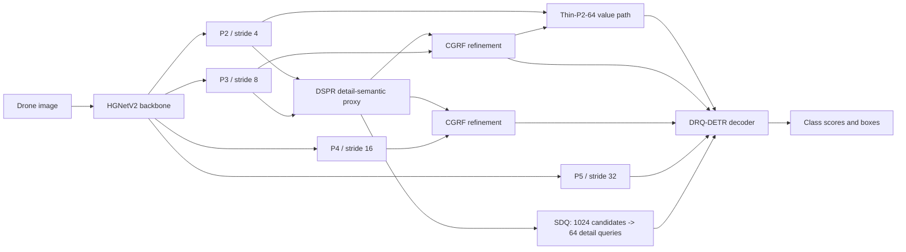

# DRQ-DETR

**Detail-Routed Query Transformer for Drone-View Small Object Detection**

DRQ-DETR is a lightweight transformer detector for small and densely distributed
objects in drone imagery. It routes high-resolution detail evidence into query
initialization and multi-scale feature refinement while retaining a compact
stride-4 value path. The public final model uses a 64-channel Thin-P2 path and
does **not** use Detail Gate Alignment (DGA) in its training objective.

This repository is organized as a reviewer-oriented research release. It
contains the model implementation, paper experiment configs, ablation and
sensitivity entries, checkpoint validation helpers, and a reproducible FPS
benchmark.

## Highlights

- **Detail-Semantic Proxy Router (DSPR):** combines shallow edge-sensitive
  detail with P3 semantic context to form a compact stride-4 proxy.
- **Sparse Detail Query Selection (SDQ):** selects 64 detail-aware queries from
  1024 proxy candidates and combines them with semantic queries.
- **Cross-Granularity Receptive-Field Fusion (CGRF):** injects gated detail
  evidence into P3 and P4 before neck aggregation.
- **Thin-P2-64 value path:** preserves high-resolution information with a
  narrow 64-channel branch rather than a full-width P2 detection stage.
- **Cross-domain evaluation:** the same training protocol is used on SARD,
  SeaDronesSee-ODv2, and VisDrone2019.

## Final Model Definition

The name **DRQ-DETR** refers to the following fixed public configuration:

| Component | Public setting |
|---|---:|
| Input resolution | 640 x 640 |
| Backbone | HGNetV2-B0 style backbone |
| Decoder queries | 300 |
| DSPR proxy stride | 4 |
| SDQ candidate count | 1024 |
| SDQ detail-query count | 64 |
| Semantic-query count | 236 |
| Decoder value strides | 4, 8, 16, 32 |
| Thin-P2 width | 64 channels |
| Decoder layers | 3 |
| DGA regularizer | Disabled |

The canonical architecture is
[`configs/models/drq_detr_p2_64.yml`](configs/models/drq_detr_p2_64.yml).



DSPR is used as a query-routing proxy. The independent Thin-P2-64 branch is the
stride-4 decoder value feature. Keeping these two roles separate is important
when reproducing the architecture.

## Verified Main Results

The following entries correspond to the final P2-64 model without DGA.
Detection metrics are COCO-style percentage points. FPS was measured at batch
size 1 with 640 x 640 FP32 input on one NVIDIA GeForce RTX 4060 Ti and includes
post-processing.

| Dataset | AP | AP50 | AP75 | APs | APm | APl | Params (M) | GFLOPs | FPS | Latency (ms) |
|---|---:|---:|---:|---:|---:|---:|---:|---:|---:|---:|
| SARD | 62.22 | 92.41 | 70.89 | 33.29 | 64.91 | 75.13 | 12.00 | 54.07 | 37.37 | 26.76 |
| SeaDronesSee-ODv2 | 52.65 | 84.62 | 53.97 | 48.42 | 51.25 | 68.28 | 12.00 | 54.16 | 37.71 | 26.52 |
| VisDrone2019 | 29.14 | 46.78 | 30.49 | 21.32 | 39.14 | 43.28 | 12.01 | 54.23 | 29.36 | 34.06 |

Small differences in parameter count and computation arise from the
dataset-specific classification heads.

## Repository Layout

```text
DRQ-DETR/
|-- configs/
|   |-- base/                         Shared runtime, data, and optimizer config
|   |-- datasets/                     COCO-format dataset definitions
|   |-- experiments/
|   |   |-- sard/
|   |   |-- seadronessee_odv2/
|   |   `-- visdrone2019/
|   `-- models/
|       |-- drq_detr_p2_64.yml        Final architecture
|       `-- sensitivity/              Sensitivity-study architectures
|-- docs/
|   |-- CHECKPOINTS.md
|   |-- DATASETS.md
|   |-- EXPERIMENTS.md
|   `-- REPRODUCIBILITY.md
|-- engine/                           Model, loss, data, and solver implementation
|-- scripts/
|   |-- benchmark_fps.py
|   |-- check_configs.py
|   |-- validate_checkpoint.ps1
|   `-- validate_checkpoint.sh
|-- train.py
|-- requirements.txt
`-- LICENSE
```

## Installation

The reference environment uses Python 3.10, PyTorch 2.3.0, and torchvision
0.18.0. Install a PyTorch build compatible with the local CUDA driver before
installing the remaining packages.

```bash
conda create -n drq-detr python=3.10 -y
conda activate drq-detr

# CUDA 12.1 example. Select another official PyTorch index when required.
pip install torch==2.3.0 torchvision==0.18.0 \
  --index-url https://download.pytorch.org/whl/cu121

pip install -r requirements.txt
```

Optional visualization dependencies are isolated from the training
requirements:

```bash
pip install -r requirements-optional.txt
```

Run the static release check after installation:

```bash
python scripts/check_configs.py
```

To additionally instantiate all three final models:

```bash
python scripts/check_configs.py --build-model
```

## Dataset Preparation

All annotations must use COCO detection JSON format. The default relative
layout is:

```text
data/
|-- sard/
|   |-- images/
|   |   |-- train/
|   |   `-- val/
|   `-- annotations/
|       |-- instances_train.json
|       `-- instances_val.json
|-- seadronessee_odv2/
|   |-- images/
|   |   |-- train/
|   |   `-- val/
|   `-- annotations/
|       |-- instances_train.json
|       `-- instances_val.json
`-- visdrone2019/
    |-- train/images/
    |-- val/images/
    `-- annotations/
        |-- instances_train.json
        `-- instances_val.json
```

Dataset head settings are intentionally different:

| Dataset | `num_classes` | Category handling |
|---|---:|---|
| SARD | 1 | One foreground class, original category id retained |
| SeaDronesSee-ODv2 | 6 | Category id 0 is ignored; five foreground ids are evaluated |
| VisDrone2019 | 10 | Ten foreground classes with COCO-style remapping |

If the local data are stored elsewhere, either edit the dataset YAML or use
runtime overrides:

```bash
python train.py \
  -c configs/experiments/sard/drq_detr.yml \
  --seed 0 \
  -u train_dataloader.dataset.img_folder=/data/SARD/train/images \
     train_dataloader.dataset.ann_file=/data/SARD/instances_train.json \
     val_dataloader.dataset.img_folder=/data/SARD/val/images \
     val_dataloader.dataset.ann_file=/data/SARD/instances_val.json
```

See [`docs/DATASETS.md`](docs/DATASETS.md) for category and annotation checks.

## Main Experiment Configs

Use these three files for the paper's final model:

```text
configs/experiments/sard/drq_detr.yml
configs/experiments/seadronessee_odv2/drq_detr.yml
configs/experiments/visdrone2019/drq_detr.yml
```

They share [`configs/experiments/_fair132_common.yml`](configs/experiments/_fair132_common.yml):

| Training item | Setting |
|---|---:|
| Epochs | 132 |
| Total batch size | 12 |
| Optimizer | AdamW |
| Base learning rate | 0.0004 |
| Backbone learning rate | 0.0002 |
| Weight decay | 0.0001 |
| Warmup iterations | 2000 |
| Gradient clipping | 0.1 |
| AMP | Enabled |
| EMA | Enabled |
| Pretrained backbone | Disabled |
| Strong augmentation schedule | Epochs 4 to 120 |
| MixUp interval | Epochs 4 to 64 |
| Multi-scale interval | Before epoch 120 |
| Multi-scale range | 480 to 800, centered on 640 |

### Train

```bash
python train.py \
  -c configs/experiments/visdrone2019/drq_detr.yml \
  --seed 0
```

The YAML setting controls AMP by default. Use `--no-use-amp` only when a
deliberate FP32 training run is required.

Resume an interrupted run from its latest resumable checkpoint:

```bash
python train.py \
  -c configs/experiments/visdrone2019/drq_detr.yml \
  -r outputs/visdrone2019/drq_detr/last.pth \
  --seed 0
```

### Evaluate

Use `best_stg2.pth` for the paper result:

```bash
python train.py \
  -c configs/experiments/visdrone2019/drq_detr.yml \
  -r checkpoints/visdrone2019/drq_detr/best_stg2.pth \
  --test-only
```

Portable helper scripts are also provided:

```bash
CHECKPOINT=checkpoints/visdrone2019/drq_detr/best_stg2.pth \
VAL_IMAGES=data/visdrone2019/val/images \
VAL_JSON=data/visdrone2019/annotations/instances_val.json \
bash scripts/validate_checkpoint.sh
```

```powershell
.\scripts\validate_checkpoint.ps1 `
  -Checkpoint checkpoints\visdrone2019\drq_detr\best_stg2.pth `
  -ValImages data\visdrone2019\val\images `
  -ValJson data\visdrone2019\annotations\instances_val.json
```

## Checkpoint Semantics

Training has two checkpoint stages:

- `best_stg1.pth`: best validation AP before strong augmentation and
  multi-scale training stop at epoch 120.
- `best_stg2.pth`: best validation AP during the final refinement stage. This
  is the checkpoint used for paper evaluation and reviewer release.
- `last.pth`: resumable state from the first stage. It is not a substitute for
  the final best checkpoint.

Each checkpoint contains the raw model, optimizer state, and EMA state. The
evaluation and FPS utilities prefer `ema.module`, matching the validation path
used during training. Historical files named `best.pth` are not canonical.

See [`docs/CHECKPOINTS.md`](docs/CHECKPOINTS.md) for the expected release
package.

## Ablation and Sensitivity Experiments

DGA is a training-only Detail Gate Alignment regularizer. It adds no
inference-time parameters or FLOPs. It is retained only for explicitly named
controlled ablations and is disabled in the final public model.

The public config names encode the factors explicitly:

```text
ablation_sdq_only.yml
ablation_sdq_cgrf_no_p2_no_dga.yml
ablation_sdq_cgrf_no_p2_with_dga.yml
ablation_p2_32_no_dga.yml
ablation_p2_32_with_dga.yml
drq_detr.yml
drq_detr_with_dga.yml
```

The VisDrone2019 sensitivity configs are under:

```text
configs/experiments/visdrone2019/sensitivity/
```

They cover SDQ candidate count, detail-query count, Thin-P2 width, and selected
joint settings. The sensitivity center is
`pre_topk=1024`, `query_topk=64`, and `P2 width=32`; the final cross-dataset
model later adopts width 64 based on the complete ablation evidence.

See [`docs/EXPERIMENTS.md`](docs/EXPERIMENTS.md) for the complete config map.

## FPS and Latency Benchmark

Place released checkpoints under the paths declared in
[`scripts/fps_benchmark_manifest.json`](scripts/fps_benchmark_manifest.json),
then run:

```bash
python scripts/benchmark_fps.py \
  --device cuda:0 \
  --imgsz 640 \
  --batch-size 1 \
  --warmup 30 \
  --iters 100 \
  --precision fp32
```

The default outputs are:

```text
outputs/benchmarks/fps_results.csv
outputs/benchmarks/fps_results.json
```

The benchmark reports model latency, post-processing latency, total latency,
p50/p95 latency, FPS, parameter count, GPU metadata, PyTorch version, CUDA
version, and checkpoint loading coverage. Timing uses CUDA events with explicit
synchronization.

Windows users running the environment in WSL can use:

```powershell
.\scripts\run_fps_benchmark_wsl.ps1
```

Detailed options are documented in
[`scripts/README_fps_benchmark.md`](scripts/README_fps_benchmark.md).

## Reproducibility Checklist

Before reporting or comparing a run:

1. Use the matching dataset config and class mapping.
2. Keep the total batch size at 12 for fair paper comparisons.
3. Use 640 x 640 validation input.
4. Keep pretrained initialization disabled.
5. Record the seed and software versions.
6. Evaluate `best_stg2.pth`, preferably from `ema.module`.
7. Confirm that all checkpoint keys load into the intended architecture.
8. Measure FPS with batch size 1, FP32, and the same post-processing scope.
9. Do not mix P2-32 and P2-64 checkpoints or DGA and non-DGA configs.
10. Run `python scripts/check_configs.py --build-model` before release.

Additional details are in
[`docs/REPRODUCIBILITY.md`](docs/REPRODUCIBILITY.md).

## Compatibility Notes

- `DRQ_DETR` is the public registry name.
- `DEIM_MG` is retained as an internal compatibility alias so previously
  trained checkpoints keep the same parameter structure.
- `drq_detr_full.yml` remains as a legacy alias for `drq_detr.yml`.
- `ablation_thinp2_no_dga.yml` remains as a legacy alias for
  `ablation_p2_32_no_dga.yml`.
- Public documentation and new scripts use only the canonical names.

## Troubleshooting

**A checkpoint loads only a subset of keys.**  
Verify that the dataset head, Thin-P2 width, SDQ settings, and DGA experiment
config match the checkpoint. The FPS JSON records loaded and skipped key counts.

**CUDA out of memory occurs during training.**  
Keep the paper config unchanged for reported comparisons. For debugging only,
reduce `train_dataloader.total_batch_size`; such a run is not directly
comparable unless the learning-rate protocol is revalidated.

**Evaluation produces incorrect class labels.**  
Check the category ids in the COCO JSON against `num_classes` and
`remap_mscoco_category`. SeaDronesSee-ODv2 intentionally reserves id 0.

**AMP is unexpectedly disabled.**  
Do not pass `--no-use-amp`. The default command now respects `use_amp: True`
from the YAML config.

## License and Acknowledgements

This repository is distributed under the Apache License 2.0. The training stack
contains code derived from DEIM, D-FINE, RT-DETR, DETR, torchvision, and related
open-source projects. Original copyright notices are retained in the source.
See [`NOTICE`](NOTICE) and [`LICENSE`](LICENSE).

Citation metadata will be added after the associated manuscript is publicly
available. For anonymous review, please refer to the method as **DRQ-DETR:
Detail-Routed Query Transformer for Drone-View Small Object Detection**.
